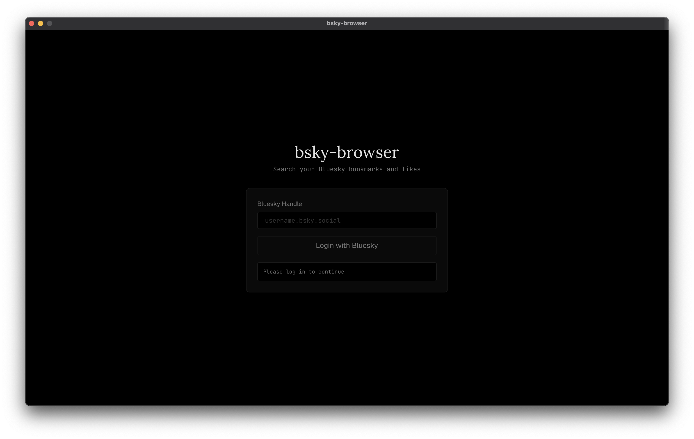
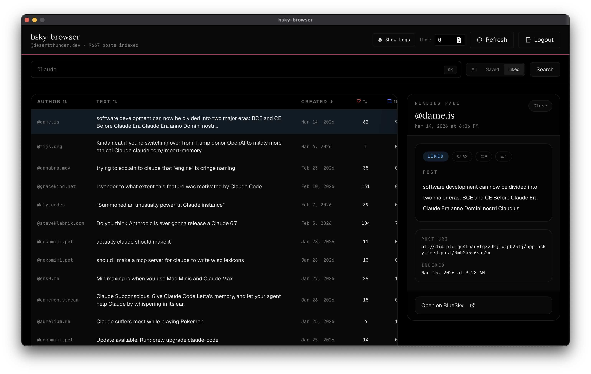
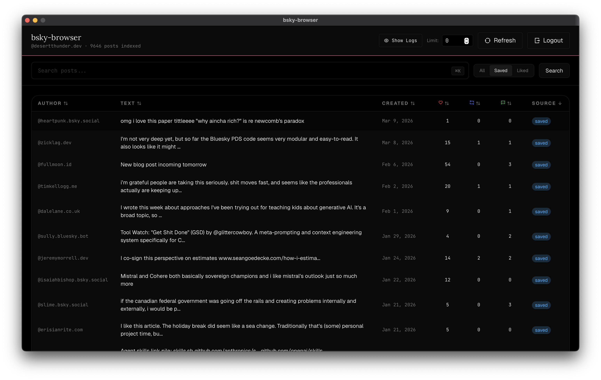
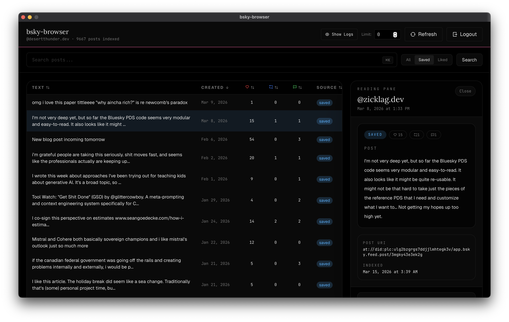
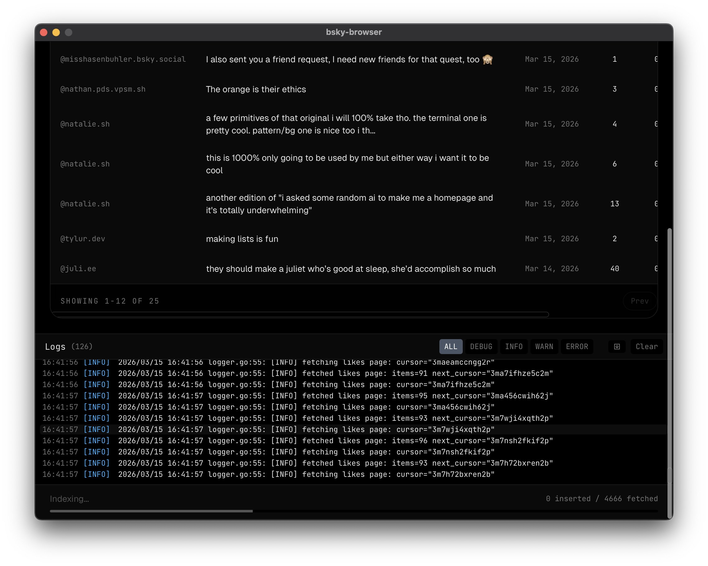

<!-- markdownlint-disable MD033 -->
# bsky-browser

A desktop app for searching your Bluesky bookmarks and likes.

> I made this to stop having to `CTRL`/`CMD`+`F` and infinite scroll through my saved
> and liked posts.

## What It Does

- Authenticates with Bluesky using loopback OAuth.
- Stores session state, tokens, and DPoP metadata in a shared SQLite database.
- Indexes bookmarks and likes into a local FTS5-backed search index.
- Lets you browse recent indexed posts or search by text.
- Renders rich-text facets for links, mentions, and hashtags.
- Includes desktop-side refresh progress events and a frontend log viewer.

## Screenshots











## Usage

1. Launch the app.
2. Enter your Bluesky handle and complete OAuth in the browser.
3. Click `Refresh` to index bookmarks and likes.
4. Use the search box to run FTS queries, or leave it empty to browse recent posts.
5. Filter results by `All`, `Saved`, or `Liked`.
6. Click a row to open the original post on `bsky.app`.

## Keyboard Shortcuts

- `Cmd+K` or `Ctrl+K`: focus the search input
- `Cmd+R` or `Ctrl+R`: refresh indexed data
- `Cmd+L` or `Ctrl+L`: toggle the log viewer

## Project

### Requirements

- Go
- [Wails v2](https://wails.io/)
- Node.js
- `pnpm`

### Install

```bash
git clone <your-repo-url>
cd bsky-browser-gui
pnpm --dir frontend install
```

If you prefer `task`, the same setup is available through:

```bash
task init
```

### Development

Start the desktop app with hot reload:

```bash
wails dev
```

Or:

```bash
task dev
```

Useful checks:

```bash
go test ./...
pnpm --dir frontend check
```

<details>
<summary>OAuth and Local Data</summary>

- OAuth callback URL: `http://127.0.0.1:8787/callback`
- Default database path: `~/.config/bsky-browser/bsky-browser.db`
- Default log directory: `~/.config/bsky-browser/logs/`

You can override paths with:

- `BSKY_BROWSER_DATA`
- `BSKY_BROWSER_LOG`
- `XDG_CONFIG_HOME`

</details>

<details>
<summary>Project Structure</summary>

- [app.go](/Users/owais/Desktop/bsky-browser-gui/app.go): app startup/shutdown wiring
- [auth_service.go](/Users/owais/Desktop/bsky-browser-gui/auth_service.go): Bluesky OAuth flow and session refresh
- [database.go](/Users/owais/Desktop/bsky-browser-gui/database.go): SQLite access, migrations, FTS search
- [index_service.go](/Users/owais/Desktop/bsky-browser-gui/index_service.go): bookmark/like indexing
- [search_service.go](/Users/owais/Desktop/bsky-browser-gui/search_service.go): Wails search bindings
- [log_service.go](/Users/owais/Desktop/bsky-browser-gui/log_service.go): log event streaming
- [frontend/src/App.svelte](/Users/owais/Desktop/bsky-browser-gui/frontend/src/App.svelte): main UI shell

</details>

<details>
<summary>Notes</summary>

- Session state is persisted so token refreshes and DPoP nonce updates survive app restarts.
- Empty searches intentionally return recent posts instead of sending an invalid FTS wildcard query.

</details>

### Production Build

Create a macOS app bundle:

```bash
wails build
```

Verified output:

```text
build/bin/bsky-browser-gui.app
```

Equivalent task:

```bash
task build
```
